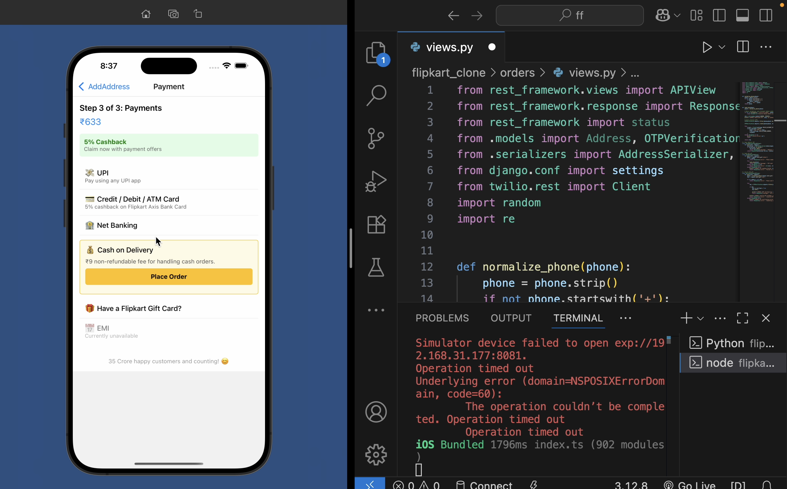
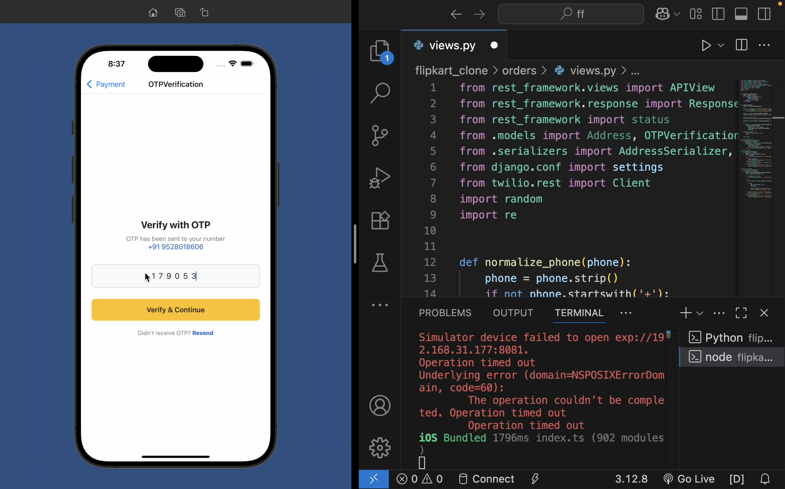
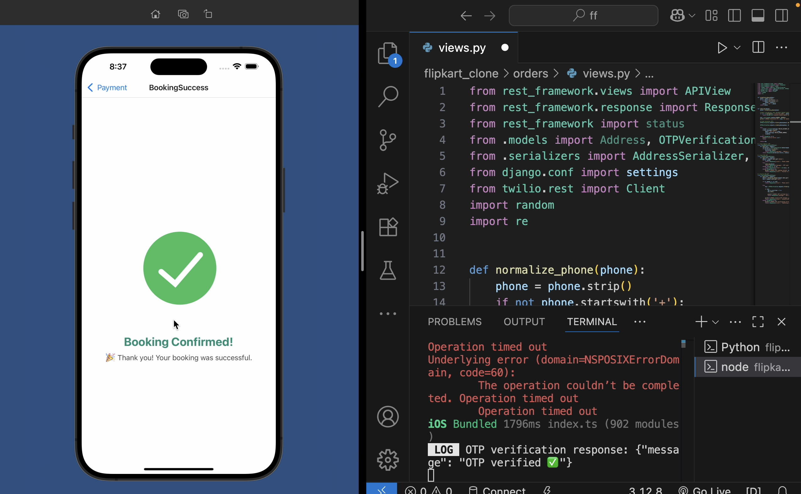

# 🚨 Hidden Risk in Order Placement Flow – Flipkart Case Study 🛒

## Overview
While placing orders on Flipkart, I observed that many users mistakenly enter **incorrect mobile numbers** while saving their delivery address. This creates serious issues:  

- 🔹 Delivery boys or even customers can misuse wrong numbers  
- 🔹 Orders often get canceled due to unreachable numbers  
- 🔹 Leads to poor user experience and trust issues  

---

## 💡 Solution
As a developer passionate about **secure and smooth UX**, I implemented a **simple but powerful solution**:

1. After the address is saved and payment method is selected  
2. 📲 An OTP is sent to the address’s mobile number  
3. 🧠 If verified — order is successfully placed  
4. 🚫 If not — user is prompted to correct the number  

> This tiny UX change reduces order failures, minimizes fraud, and enhances delivery success.  
> Small UX improvements can have a **big business impact**, just like minor tweaks in product design can increase profits significantly.

---

## 🛠 Technology Stack
- **Frontend:** React Native  
- **Backend:** Django REST Framework  
- **Authentication:** OTP-based mobile verification  
- **Database:** SQLite / PostgreSQL  
- **Version Control:** Git & GitHub  

---

## 📸 Screenshots
*(Place screenshots inside `assets/screenshots` folder)*
  
 
 
 

---

## 🔖 Features
- OTP verification at the time of order placement  
- Secure order placement and delivery  
- Reduced risk of order cancellations and fraud  
- Seamless user experience  

---

## 🔗 GitHub Repo
[Flipkart Order Case Study](https://github.com/sanij0579/FlipkartOrderCaseStudy)  

---

## 📌 Hashtags
`#UXDesign #Flipkart #EcommerceSecurity #ProductThinking #UserExperience #MobileVerification #ReactNative #Django #InnovationInSmallThings`
